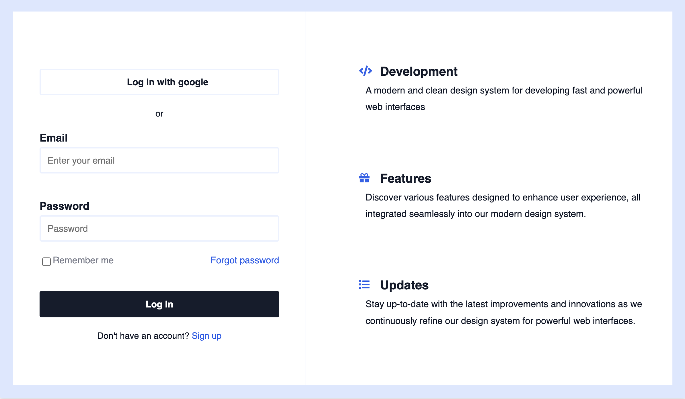

# Login Frontend Page

## Description

The Login Frontend Page is a straightforward user interface designed using HTML and CSS. It serves as a practical project to enhance skills and gain hands-on experience in frontend development.

## Demo

## Acknowledgments
This design was inspired by a [tutorial on YouTube](https://www.youtube.com/watch?v=zJSY8tbf_ys&ab_channel=freeCodeCamp.org). Special thanks to the tutorial creator for providing valuable guidance and insights.

